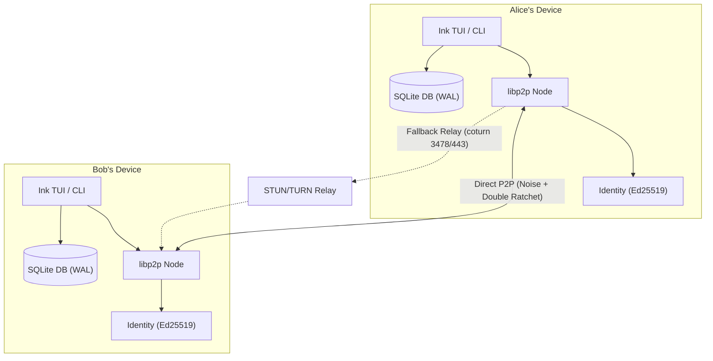

# CRYPTUS — P2P Encrypted CLI & TUI Chat

> Local-first, zero-central-server, end-to-end encrypted peer-to-peer chat client built on libp2p, Noise, and Double Ratchet.

Cryptus is a privacy-focused terminal messaging application where every peer runs the exact same binary. There are no central servers, message mailboxes, or phone number requirements. Keys and messages live exclusively on your device.

---

## Features

- **Zero Central Server**: Pure peer-to-peer networking via `libp2p` and WebRTC/ICE NAT traversal.
- **End-to-End Encryption**: Ephemeral Noise protocol transport security + Double Ratchet forward secrecy.
- **Local Identity Keystore**: Ed25519 cryptographic keypairs encrypted at rest with Argon2id + XChaCha20-Poly1305.
- **NAT Traversal & TURN Fallback**: Host, STUN, and TURN candidate gathering for connectivity behind firewalls.
- **Offline Outbox Queue**: Unsent messages queue in local SQLite (`better-sqlite3`) and retry automatically with exponential backoff and jitter.
- **Signal-Style Safety Numbers**: 60-digit deterministic fingerprint comparison and interactive verification (`chat verify`).
- **Terminal User Interface (TUI)**: Interactive Ink terminal application with threaded message streams.
- **Encrypted Backup & Restore**: `chat export` and `chat import` utilities bundling keystores and database into authenticated `.cryptus-backup` archives.

---

## Quick Start

### 1. Installation

```bash
git clone https://github.com/cryptus-org/cryptus.git
cd cryptus
npm install
npm run build
```

### 2. Initialize Identity

Generate your Ed25519 keypair and passphrase-protected keystore:

```bash
npm start init
```

### 3. Add Contact

Share invite codes with a peer to add them to your contacts:

```bash
node ./dist/cli/index.js contacts add alice chat1...
```

### 4. Terminal User Interface (TUI)

Launch the full-screen interactive TUI client:

```bash
npm start
```

### 5. Verify Safety Numbers

Compare 60-digit fingerprints out-of-band to confirm identity key integrity:

```bash
node ./dist/cli/index.js verify alice
```

---

## Command Line Interface (CLI)

```
Usage: chat [command]

Cryptus — P2P Encrypted CLI Chat

Commands:
  init                           Initialize your identity and encrypted keystore
  contacts add <name> <code>     Add a contact using their invite code
  contacts list                  List all contacts
  talk <peer>                    Start a chat session with a contact
  verify <peer>                  Verify a contact's identity fingerprint
  status <peer>                  Check delivery status of messages to a contact
  export [--out <file>]          Export an encrypted backup of your identity and messages
  import <file>                  Import identity and messages from an encrypted backup
  help [command]                 Display help for command
```

---

## Architecture



---

## Security & Threat Model

| Threat | Protection | Status |
|---|---|---|
| Eavesdropping on Network Wire | Noise Transport Encryption + Double Ratchet AEAD | Protected |
| Relay Server Compromise | Content-blind packet forwarding; relay handles ciphertext only | Protected |
| Man-In-The-Middle (MITM) at First Contact | Deterministic 60-digit Safety Numbers (`chat verify`) & key mutation alerts | Protected |
| Ephemeral Key Compromise | Per-message key rotation & destruction (Forward Secrecy) | Protected |
| Local Disk Theft | Passphrase-encrypted keystore (Argon2id + XChaCha20-Poly1305) | Protected |

---

## License

Distributed under the MIT License. See `LICENSE` for details.