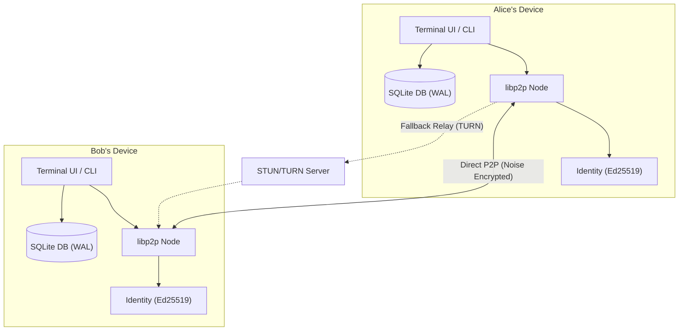

# CRYPTUS — P2P Encrypted Terminal Chat

> No servers. No phone numbers. No tracking. Just encrypted peer-to-peer messaging in your terminal.

Cryptus is a **privacy-first terminal chat app** where messages travel directly between devices — no central server ever touches your data. Your identity keys and message history live exclusively on your machine, protected by a passphrase.

---

## Quick Start (5 Minutes)

### 1. Install & Build

```bash
git clone https://github.com/cryptus-org/cryptus.git
cd cryptus
npm install
npm run build
```

**Requirements**: Node.js 22+ and npm.

### 2. Create Your Identity

```bash
node dist/cli/index.js init
```

You'll be asked to choose a **passphrase** (8+ characters) that encrypts your private key on disk. This is the only credential you'll ever need — there's no account, email, or phone number.

After setup, you'll get your unique **Peer ID** — a cryptographic fingerprint like `z2k3X...`. This is your address on the network.

### 3. Launch the TUI

```bash
node dist/cli/index.js
```

This opens the full-screen interactive terminal interface:

```
╭──────────────────────────────────────────────────────╮
│  CRYPTUS  │  Peer ID: z2k3XmL...  │  Contacts       │
╰──────────────────────────────────────────────────────╯
╭──────────────────────────────────────────────────────╮
│  > alice               [V] verified                  │
│    bob                 [U] unverified                │
╰──────────────────────────────────────────────────────╯
  [↑/↓] Navigate • [Enter] Chat • [v] Verify
  [c] Copy Peer ID • [a] Add Contact
```

### 4. Add a Contact

**In the TUI**: Press `[A]` to open the Add Contact form. You'll enter:
- **Contact Name** — Any name you choose (e.g. `alice`, `Mom`, `work-laptop`). This is your local label — **you pick the name**, just like saving a phone contact.
- **Invite Code** — The code your peer shared with you.

**Or via CLI**:
```bash
node dist/cli/index.js contacts add alice <invite-code>
```

> **How to get invite codes**: When your peer runs `node dist/cli/index.js talk <your-name>`, they'll see an invite code printed in the terminal. Share it via any channel (text, email, QR code, in person).

### 5. Start Chatting

Select a contact in the TUI and press `Enter`, or:
```bash
node dist/cli/index.js talk alice
```

### 6. Verify Identity (Recommended)

To confirm you're really talking to who you think (and not a man-in-the-middle):

In the TUI, press `[V]` on a contact, or:
```bash
node dist/cli/index.js verify alice
```

This shows a **60-digit Safety Number**. Call your contact and read it aloud — if it matches on both devices, press `[Y]` to mark them as verified.

---

## TUI Keyboard Shortcuts

### Contacts View
| Key | Action |
|---|---|
| `↑` / `↓` or `j` / `k` | Navigate contacts |
| `Enter` | Open chat with selected contact |
| `A` | Add a new contact (opens inline form) |
| `V` | Verify safety number for selected contact |
| `C` | Copy your Peer ID to clipboard |

### Chat View
| Key | Action |
|---|---|
| `Enter` | Send message |
| `Esc` | Back to contacts |

### Verify View
| Key | Action |
|---|---|
| `Y` | Confirm safety number matches |
| `N` or `Esc` | Go back without verifying |
| `C` | Copy safety number to clipboard |

### Add Contact View
| Key | Action |
|---|---|
| `Tab` | Switch between Name and Invite Code fields |
| `Enter` | Submit (when in invite code field) |
| `Esc` | Cancel and go back |

---

## CLI Reference

```
Usage: node dist/cli/index.js [command]

Commands:
  init                           Create your identity (one-time setup)
  contacts add <name> <code>     Add a contact — you choose the name
  contacts list                  List all your contacts
  talk <name>                    Start a chat session with a contact
  verify <name>                  Compare safety numbers with a contact
  status <name>                  Check message delivery status
  export [--out <file>]          Export encrypted backup
  import <file>                  Restore from encrypted backup
```

---

## Networking: How Peers Connect

Cryptus uses **ICE** (Interactive Connectivity Establishment) to find the best path between peers:

| Method | How it works | Setup needed? |
|---|---|---|
| **Direct (Host)** | Connects via LAN IP — works on same WiFi/network | None |
| **STUN** | Discovers your public IP via free Google/Cloudflare servers, connects through NAT | None (built-in) |
| **TURN** | Relays encrypted packets through your own server — guaranteed fallback | Yes (optional VPS) |

**Most home connections work without any server setup.** STUN handles NAT traversal automatically using free public servers.

### When You Need a TURN Server

You only need TURN if both peers are behind **symmetric NAT** (corporate firewalls, some mobile carriers). To set one up:

```bash
# On a VPS ($3-5/month — Oracle Cloud free tier works)
sudo apt install coturn
# Edit /etc/turnserver.conf with your IP + password
sudo systemctl start coturn
```

Then set these on each client machine:
```bash
export CRYPTUS_TURN_HOST=your-vps-ip.com
export CRYPTUS_TURN_PORT=3478
export CRYPTUS_TURN_USER=myuser
export CRYPTUS_TURN_PASS=mypassword
```

The relay **never sees message content** — it only forwards encrypted packets.

---

## Backup & Restore

Export your identity, contacts, and message history into a single encrypted file:

```bash
# Export
node dist/cli/index.js export --out my-backup.cryptus

# Restore on a new machine
node dist/cli/index.js import my-backup.cryptus
```

The backup is encrypted with a passphrase you choose at export time — it's safe to store in cloud drives.

---

## How It Works



### Under the Hood

| Component | Technology | Purpose |
|---|---|---|
| **Transport** | libp2p + TCP | Peer-to-peer networking |
| **Encryption** | Noise Protocol (XX handshake) | Wire-level encryption |
| **Identity** | Ed25519 keypairs | Cryptographic identity |
| **Key Protection** | Argon2id + XChaCha20-Poly1305 | Encrypt private key at rest |
| **Database** | SQLite (WAL mode) | Store contacts, messages, sessions |
| **NAT Traversal** | ICE + STUN + TURN (werift) | Connect through firewalls |
| **Verification** | 60-digit Safety Numbers | Signal-style identity verification |
| **TUI** | Ink (React for terminals) | Interactive terminal interface |

---

## Security & Threat Model

| Threat | How Cryptus Protects You |
|---|---|
| **Network eavesdropping** | Noise Protocol encrypts all traffic on the wire |
| **Relay server compromise** | TURN server only forwards ciphertext — zero knowledge of content |
| **Man-in-the-middle** | 60-digit Safety Numbers + key change alerts |
| **Stolen device / disk theft** | Private key encrypted with Argon2id + XChaCha20-Poly1305 |
| **Unsent messages** | Queued locally in SQLite, retried automatically with exponential backoff |

---

## FAQ

**Q: Can I choose my own name?**
Yes! When you add a contact, **you choose what name to call them** — it's saved locally on your device only (like saving a contact on your phone). Your contacts independently choose what to call you on their device.

**Q: Does the other person see my chosen name?**
No. Names are local-only labels. The other person sees your Peer ID until they name you on their end.

**Q: What if I lose my device?**
Use `export` to create encrypted backups. Restore on a new device with `import`. Without a backup, your identity and message history are gone — there's no server to recover from.

**Q: Is a TURN server required?**
No. Most connections work with just STUN (built-in, free). TURN is only needed when both peers are behind strict corporate firewalls.

**Q: What data is stored locally?**
Everything lives in `~/.cryptus/`:
- `keystore.json` — Your encrypted private key
- `identity.json` — Your public key + Peer ID
- `cryptus.db` — Contacts, messages, and sessions (SQLite)

---

## License

Distributed under the MIT License. See `LICENSE` for details.